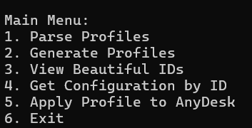

# Генератор и парсер профилей AnyDesk (ID)


**Генератор и парсер профилей AnyDesk** — это инструмент для автоматической генерации, анализа и управления профилями AnyDesk.
Скрипт позволяет создавать новые профили, находить "красивые" ID, просматривать конфигурации и применять выбранные профили в AnyDesk.

---

## Основные возможности

1. **Генерация профилей AnyDesk**:

   - Создание новых профилей с уникальными ID.
   - Настройка времени ожидания для каждого профиля.
2. **Поиск "красивых" ID**:

   - Повторяющиеся цифры (например, `55555`).
   - Возрастающие (`1234`) и убывающие (`4321`) последовательности.
   - Палиндромы (например, `123321`).
   - Специальные числа: `228`, `1488`, `322`.
3. **Просмотр конфигураций**:

   - Возможность просмотра содержимого файла `system.conf` по конкретному ID.
4. **Применение профиля в AnyDesk**:

   - Копирование выбранной конфигурации в папку AnyDesk пользователя.
   - Запуск AnyDesk с новым профилем.
5. **Подсветка "красивых" ID**:

   - Различные цвета для разных типов "красивых" ID:
     - Повторяющиеся цифры: **красный**.
     - Возрастающие последовательности: **зеленый**.
     - Убывающие последовательности: **желтый**.
     - Палиндромы: **синий**.
     - Специальные числа: **магента**.

---

## Установка

1. **Python 3.6+**:

   - Убедитесь, что Python установлен на вашем компьютере. Вы можете скачать его [здесь](https://www.python.org/downloads/).
2. **Библиотеки**:

   - Установите необходимую библиотеку `psutil` с помощью команды:

     ```bash
     pip install psutil
     ```
3. **AnyDesk**:

   - Скрипт использует исполняемый файл `AnyDesk.exe`. Убедитесь, что он находится в одной папке со скриптом или укажите путь к нему.

---

## Использование

1. **Запуск программы**:
   Запустите скрипт в терминале:

   ```bash
   python main.py

   ```
2. **Главное меню**:
   После запуска вы увидите главное меню:
   

## Примечания об отображении цветов

* Поддержка цветов:
  * Скрипт использует ANSI-escape коды для цветного вывода.
  * Для корректного отображения цветов рекомендуется использовать Windows Terminal или любой современный эмулятор терминала, поддерживающий ANSI-цвета.
  * Если вы используете стандартный Windows Command Prompt (cmd.exe), цвета могут отображаться некорректно из-за ограниченной поддержки ANSI.

## Примеры работы

1. "Beautiful" IDs:
   

## Структура проекта

```
project/
│
├── main.py                # Основной скрипт
├── profiles/              # Папка для хранения профилей
│   ├── AD1/
│   │   └── AnyDesk/
│   │       └── system.conf
│   ├── AD2/
│   │   └── AnyDesk/
│   │       └── system.conf
│   └── ...
└── README.md              # Документация
```

## Лицензия

Этот проект распространяется под лицензией [MIT License](LICENSE). Вы можете свободно использовать, изменять и распространять этот код.

## Автор

Автор: **urbnywrt**
GitHub: [urbnywrt](https://github.com/urbnywrt)