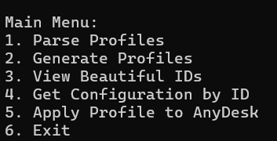
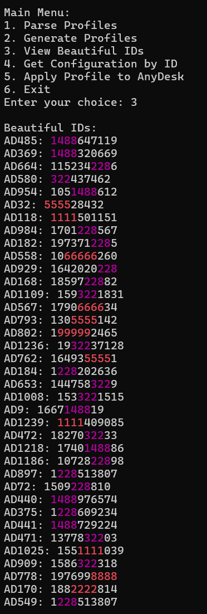

# AnyDesk Profile Generator and Parser (ID)


**AnyDesk Profile Generator and Parser** is a tool for automatically generating, analyzing, and managing AnyDesk profiles. The script allows you to create new profiles, find "beautiful" IDs, view configurations, and apply selected profiles in AnyDesk.

> **Note**: A Russian version of this README is available [here](README-ru.md).
---

## Features

1. **Generate AnyDesk Profiles**:

   - Create new profiles with unique IDs.
   - Configure timeout for each profile generation.
2. **Find "Beautiful" IDs**:

   - Repeating digits (e.g., `55555`).
   - Ascending (`1234`) and descending (`4321`) sequences.
   - Palindromes (e.g., `123321`).
   - Special numbers: `228`, `1488`, `322`.
3. **View Configurations**:

   - View the contents of the `system.conf` file by a specific ID.
4. **Apply a Profile to AnyDesk**:

   - Copy the selected configuration to the user's AnyDesk folder.
   - Launch AnyDesk with the new profile.
5. **Highlight "Beautiful" IDs**:

   - Different colors for different types of "beautiful" IDs:
     - Repeating digits: **red**.
     - Ascending sequences: **green**.
     - Descending sequences: **yellow**.
     - Palindromes: **blue**.
     - Special numbers: **magenta**.

---

## Installation

1. **Python 3.6+**:

   - Make sure Python is installed on your computer. You can download it [here](https://www.python.org/downloads/).
2. **Libraries**:

   - Install the required library `psutil` using the following command:

     ```bash
     pip install psutil
     ```
3. **AnyDesk**:

   - The script uses the `AnyDesk.exe` executable file. Ensure it is located in the same folder as the script or specify its path.

---

## Usage

1. **Run the Program**:
   Start the script in the terminal:

   ```bash
   python main.py
   ```
2. **Main Menu** :
   After launching, you will see the main menu:
   

## Notes on Color Display

* **Color Support**
  * The script uses ANSI escape codes for colored output.
  * For correct color display, it is recommended to use Windows Terminal or any modern terminal emulator that supports ANSI colors.
  * If you are using the default Windows Command Prompt (cmd.exe), colors may not display correctly due to limited ANSI support.


## Examples

1. "Beautiful" IDs:
   

## Project Structure

```
project/
│
├── main.py                # Main script
├── profiles/              # Folder for storing profiles
│   ├── AD1/
│   │   └── AnyDesk/
│   │       └── system.conf
│   ├── AD2/
│   │   └── AnyDesk/
│   │       └── system.conf
│   └── ...
└── README.md              # Documentation
```

## License

This project is distributed under the [MIT License](LICENSE). You can freely use, modify, and distribute this code.

## Author

Author: **urbnywrt**
GitHub: [urbnywrt](https://github.com/urbnywrt)
